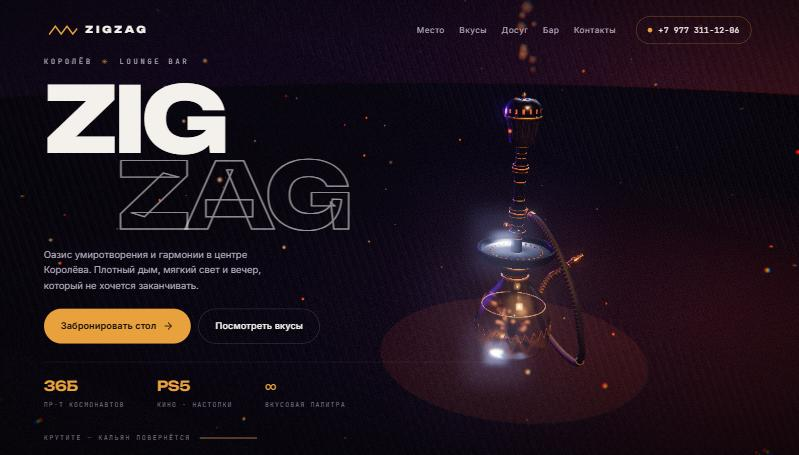
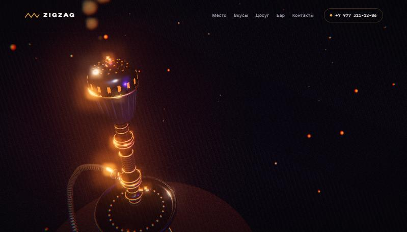
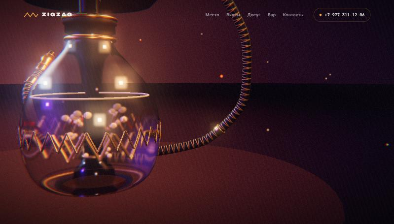

# ZigZag — 3D-сайт для lounge bar

Одностраничный сайт для кальянной **ZigZag** (Королёв), построенный вокруг одной
трёхмерной модели кальяна. Пока вы листаете страницу, камера облетает модель
по кругу: каждая секция сайта показывает кальян с новой стороны, в своём свете
и с новой плотностью дыма.

> Это демо-проект: сайт сделан по открытой информации с [страницы заведения во ВКонтакте](https://vk.ru/zigzag_korolev),
> чтобы показать, как мог бы выглядеть их сайт. Название, адрес и тексты принадлежат заведению.



<table>
  <tr>
    <td></td>
    <td></td>
  </tr>
  <tr>
    <td align="center"><sub>Чаша с перфорированным колпаком и тлеющими углями</sub></td>
    <td align="center"><sub>Колба: жидкость, пузырьки и золотой зигзаг</sub></td>
  </tr>
</table>

## Что внутри

**Модель.** Кальян целиком собран в коде, готового файла `.glb` нет. Основные детали
получены вращением профиля вокруг оси, шланг построен по кривой. Из-за этого сайт
почти ничего не загружает, а пропорции меняются правкой пары чисел.

- стеклянная колба с преломлением и янтарной жидкостью, внутри поднимаются пузырьки;
- золотой зигзаг-логотип, вписанный в стекло по кругу;
- стойка с рифлёными кольцами, гранёной бусиной, резиновыми и золотыми манжетами;
- диффузор с прорезями, блюдце с золотыми «заклёпками»;
- чаша с насечками, колпак с перфорацией, тлеющие угли, которые «дышат» и подсвечивают вентиляционные щели;
- шланг в оплётке с фирменным зигзагом, обжимные манжеты, мундштук с кольцами.

**Сцена.** Студийный свет собран в коде (янтарный, фиолетовый, холодный контровой),
зеркальный пол, дым и угольки на GPU, bloom, зерно, виньетка и хроматическая аберрация.

**Движение.** Шесть ключевых кадров камеры соединены сплайном Catmull-Rom, за ним
следует критически демпфированная пружина. Скорость нигде не падает до нуля,
поэтому облёт получается непрерывным.

**Дизайн.** Тёмная палитра с янтарным акцентом, шрифты Unbounded, Inter и JetBrains Mono
(все с кириллицей), стеклянные панели с текстом, адаптивная вёрстка от телефона до широкого экрана.

## Технологии

| | |
|---|---|
| 3D | [three.js](https://threejs.org) (WebGL, PBR-материалы, пост-обработка) |
| Скролл | [Lenis](https://github.com/darkroomengineering/lenis) |
| Сборка | [Vite](https://vite.dev) |
| Остальное | чистые HTML, CSS и JavaScript, без фреймворков |

После сборки сайт весит около 150 КБ в gzip вместе с three.js.

## Запуск

Нужен [Node.js](https://nodejs.org) 18 или новее.

```bash
npm install
```

```bash
npm run dev
```

Сайт откроется на `http://localhost:5183`.

```bash
npm run build
```

Готовый статический сайт окажется в папке `dist/`. Его можно выложить на любой хостинг:
GitHub Pages, Netlify, Vercel или обычный nginx. Сервер для него не нужен.

## Структура проекта

```
index.html              тексты, контакты и разметка для поисковиков (Schema.org)
src/
  main.js               загрузка: прелоадер, сцена, скролл, вступительная анимация
  scroll.js             кадры камеры, сплайн и пружина
  ui.js                 прелоадер и мобильное меню
  styles.css            дизайн-токены и вёрстка
  three/
    world.js            рендерер, свет, пол, пост-обработка, главный цикл
    hookah.js           модель кальяна
    env.js              студийное освещение и фон
    atmosphere.js       дым и угольки
    grade.js            финальная цветокоррекция
    textures.js         текстуры, нарисованные на canvas
docs/screenshots/       картинки для README
```

## Как поменять

**Тексты, телефон, адрес** лежат в `index.html`. Телефон повторяется в шапке, мобильном меню,
карточке контактов и в блоке Schema.org внутри `<head>`, обновлять нужно все четыре места.

**Кадры камеры** описаны массивом `KEYS` в `src/scroll.js`. Одна строка соответствует одной секции:

| поле | что делает |
|---|---|
| `radius` | расстояние до модели |
| `theta` | угол облёта в радианах, растёт от секции к секции |
| `phi` | наклон камеры: `0` сверху, `1.57` на уровне глаз |
| `ty` | высота точки, на которую смотрит камера |
| `fov` | угол объектива |
| `offX` | сдвиг модели по горизонтали, чтобы она не лежала под текстом |
| `smoke`, `bloom`, `exposure` | дым, свечение, экспозиция |

**Форма кальяна** задаётся профилями `P_VASE`, `P_STEM`, `P_BOWL` и другими в `src/three/hookah.js`.
Каждый профиль — список точек `[радиус, высота]`. Мелкие детали собраны в блоке `DETAIL PASS` в конце файла.

## Производительность и доступность

- На телефонах и слабых видеокартах автоматически упрощается сцена: меньше геометрии и частиц, без теней и зеркального пола.
- Если первые секунды идут медленнее 40 кадров в секунду, разрешение рендера снижается.
- В фоновой вкладке рендер останавливается.
- При включённом `prefers-reduced-motion` отключаются плавный скролл, параллакс, зерно и инерция камеры.
- Без WebGL остаётся рабочая страница с текстом и контактами на нарисованном фоне.
- Есть skip-link, видимый фокус, описание для канваса; контраст текста выше 4.5:1.

## Что не заполнено

Часов работы, цен и фотографий зала в открытых источниках нет, поэтому в проекте их нет.
В блоке «Контакты» вместо графика стоит «Ежедневно, время уточняйте по телефону».
Когда появятся реальные данные, их нужно добавить в `index.html` и в `openingHours` в разметке Schema.org.

## Лицензия

Лицензия кода пока не выбрана. Название, адрес, телефон и тексты принадлежат заведению ZigZag.
